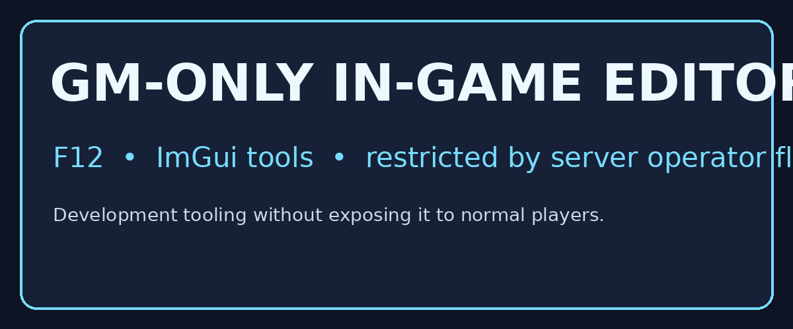

# LinuxMu

### MU Online. Native on Linux.

LinuxMu is a native Linux engineering fork of the MuMain client for OpenMU. It builds as a Linux x86_64 ELF executable with SDL3, OpenGL and native networking.

  

## GM tools

The development build includes an ImGui tool layer. Press F12 after entering the world. Authorization is checked against the character operator flags.

  

## Roadmap

- [x] Native Linux client
- [x] Native OpenMU connection
- [x] GM-only development tools
- [ ] Terrain world editor

## Credits

Built on top of [MuMain](https://github.com/sven-n/MuMain) and the [OpenMU](https://github.com/MUnique/OpenMU) ecosystem. Maintained by Allan Odreman.

