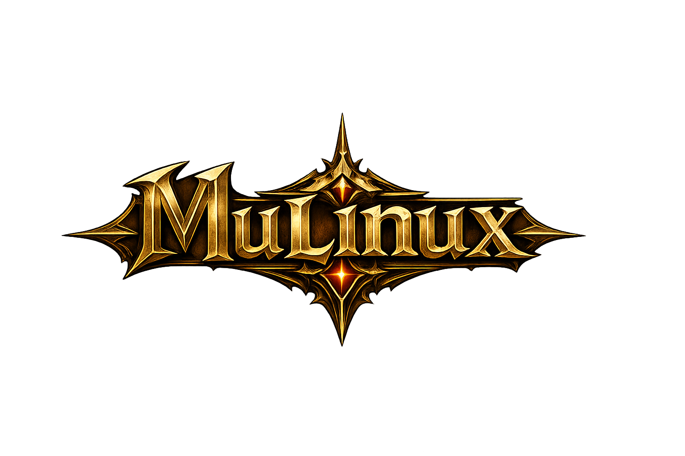

<div align="center">
  

  <h1>LinuxMu</h1>
  <p><strong>MU Online. Native on Linux.</strong></p>
  <p>Una implementación nativa para conectar MuMain con servidores OpenMU desde Linux.</p>

  <p>
    <a href="https://github.com/mrallanodreman/LinuxMu/stargazers"></a>
    <a href="https://github.com/mrallanodreman/LinuxMu/commits/main"></a>
    
    
  </p>
</div>

---

## Overview

**LinuxMu** is a focused Linux port of the MuMain client for the [OpenMU](https://github.com/MUnique/OpenMU) ecosystem. The project targets a native x86_64 experience with a modern SDL3/OpenGL foundation, direct TCP connectivity and a build workflow designed for Linux development.

> The goal is simple: bring the classic MU client experience to Linux without depending on a Windows compatibility layer.

## Highlights

- Native Linux x86_64 executable
- SDL3 platform and input layer
- OpenGL rendering pipeline
- Native OpenMU connection flow
- CMake-based build foundation
- Development tooling for controlled GM workflows

## Architecture

```text
┌──────────────────────┐       TCP        ┌──────────────────────┐
│      LinuxMu         │ ───────────────▶ │       OpenMU          │
│  SDL3 · OpenGL · C++ │                  │ Connect + GameServer │
└──────────────────────┘                  └──────────────────────┘
```

## Build status

| Component | Status |
|---|---|
| Linux x86_64 client | ✅ Built |
| SDL3 / OpenGL integration | ✅ Active |
| OpenMU connectivity | ✅ Working |
| Native networking | ✅ Working |
| GM development tools | ✅ Available |
| Terrain editor | 🔧 Planned |

## Development

The client is developed and tested on Linux with CMake, a C++20 toolchain, SDL3, OpenGL and the OpenMU server stack. See the project history and upstream references for implementation context.

## Lineage

LinuxMu is built on the work of:

- [MuMain](https://github.com/sven-n/MuMain) — open-source MU client foundation
- [OpenMU](https://github.com/MUnique/OpenMU) — open-source MU server ecosystem

## Roadmap

- [x] Native Linux client
- [x] OpenMU connection flow
- [x] SDL3/OpenGL platform layer
- [x] GM-only development tooling
- [ ] Installer and distributable packages
- [ ] Terrain/world editor
- [ ] Automated Linux release builds

## Maintainer

Maintained by **Allan Odreman**.

## License

This project follows the licensing terms of its source components. See the repository license and upstream projects before redistributing client assets or builds.
