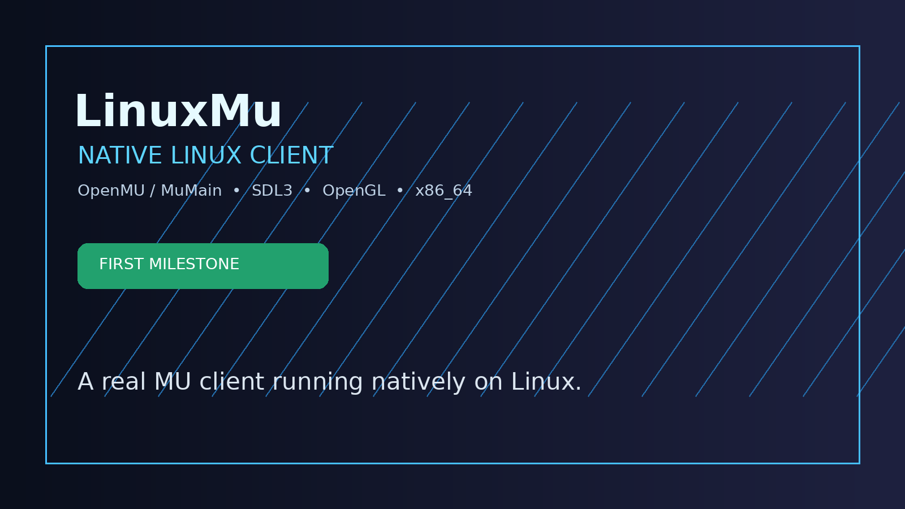

# LinunMu

\n> Native Linux client engineering for OpenMU / MuMain.

### Native Linux client

LinuxMu is our native x86_64 Linux client work for the MuMAIN / OpenMU stack, built with SDL3, OpenGL and the native C#3p client library.

This is the first fully functional native Linux main client milestone.

!

### Features

- Native x86_64 Linux executable
- SDL3 and OpenGL windowing and rendering
- Native network library
- Assets and audio loading
- GG-only development tooling

### Origin

https://github.com/sven-n/MuMain
